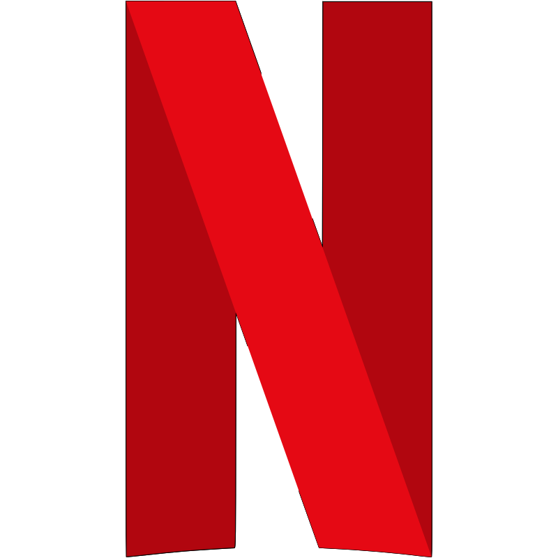

<p align="center"></p> 
<h2 align="center"><b>Netflix Clone</b></h2>
<h4 align="center">A React Native app that replicates the popular streaming platform <a href="https://www.netflix.com" target="_blank">Netflix</a></h4>

## Screenshots

[](fastlane/metadata/android/en-US/images/phoneScreenshots/shot_02.png)
[](fastlane/metadata/android/en-US/images/phoneScreenshots/shot_01.png)
[](fastlane/metadata/android/en-US/images/phoneScreenshots/shot_02.png)
[](fastlane/metadata/android/en-US/images/phoneScreenshots/shot_01.png)
[](fastlane/metadata/android/en-US/images/phoneScreenshots/shot_03.png)
[](fastlane/metadata/android/en-US/images/phoneScreenshots/shot_01.png)
[](fastlane/metadata/android/en-US/images/phoneScreenshots/shot_02.png)
[](fastlane/metadata/android/en-US/images/phoneScreenshots/shot_03.png)
[](fastlane/metadata/android/en-US/images/phoneScreenshots/shot_03.png)
[](fastlane/metadata/android/en-US/images/phoneScreenshots/shot_03.png)

## Description

This cross-platform app is built using React Native and is designed to replicate the functionality and aesthetic of the world-renowned <a href="https://www.netflix.com" target="_blank">Netflix</a> app. Using an API built specifically for this purpose, it's a great way to learn and experience React Native development. The repository for the back-end API can be found at <a href="https://github.com/NoureldinAmer/NetflixClone-be" target="_blank">this link</a>.  

### Features

* Add Movies and TV shows to Your Watchlist
* Play Movies and TV Shows from within the application
* Presist Your Watch History
* Share Movie and TV Show Links
* Intuitive Movie and TV Show Search
* Homepage Featuring Trending Movies and Shows
* Explore page showing upcoming Movies and TV shows

## Install and Run the Project
1. Clone this repository to your local machine.

```bash
git clone https://github.com/NoureldinAmer/NetflixClone.git
```

2. Install the necessary dependencies.
```bash
cd NetflixClone
npm install
```

3. Install the Expo CLI globally on your machine.
```bash
npm install -g expo-cli
```

4. Start the project.
```bash
expo start
```
